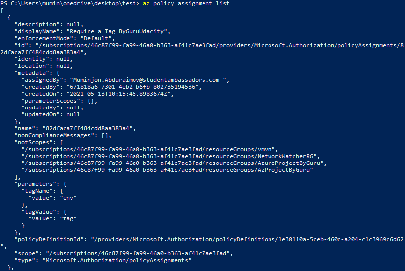

# Azure IaaS - Deploy Scalable Servers

This is a project which creates scalable servers and deploys them into Microsoft Azure

Used Tools
* Packer
* Terraform
* Microsoft Azure

# Overview of the project and files

It includes **server.json** and **main.tf** files to create a server template and automation of deployment of the created servers. The **variables.tf** file helps you to make adjustments easily.

All the files are prepared to create these resources:
* Virtual Network
* Availibility Set
* Subnet
* Public IP
* Network Security Group (to protect subnet)
* N number of servers (VMs) with the help of Packer generated Image (Linux)
* The Load Balancer to handle requests on port 80

# Prerequisites

* [Microsoft Azure](https://azure.microsoft.com/) Account
* Installation of Terraform - [terraform](https://www.terraform.io/downloads.html) 
* Installation of Packer - [packer](https://www.packer.io/downloads) 
* Creation of Service Principcal in Azure - [SP](https://docs.microsoft.com/en-us/powershell/azure/create-azure-service-principal-azureps?view=azps-5.9.0#:~:text=An%20Azure%20service%20principal%20is,accessed%20and%20at%20which%20level.) 
* *Client_ID*, *Client_Secret* and *Subscription_ID* for **server.json** file - [tutorial](https://docs.microsoft.com/en-us/azure/active-directory/develop/howto-create-service-principal-portal)

## Usage

You can modify the variables part in the **server.json** file and **variables.tf** for **main.tf** file

All the variables are specified in the **variables.tf** file to make future configurations easy. While building using these files you should specify variable values in the command line.

```powershell
0) packer build server.json

1) terraform init

2) terraform plan -out solution.plan

3) terraform apply

4) terraform destroy
```
## Deployed Policy


## Output


```powershell
Saved the plan to: solution.plan

To perform exactly these actions, run the following command to apply:
    terraform apply "solution.plan"
PS C:\Users\mumin\onedrive\desktop\test> terraform apply
var.location
  The Azure Region in which all resources in this example should be created.

  Enter a value: East US

var.password
  The Password for the VM Image

  Enter a value: Uv7ZUigh15f-42U

var.prefix
  The prefix which should be used for all resources in this example

  Enter a value: AzProject

var.username
  The username for the VM Image

  Enter a value: AdminGuru


Terraform used the selected providers to generate the following execution plan. Resource actions are indicated with
the following symbols:
  + create
 <= read (data resources)

Terraform will perform the following actions:

  # data.azurerm_public_ip.main will be read during apply
  # (config refers to values not yet known)
 <= data "azurerm_public_ip" "main"  {
      + allocation_method       = (known after apply)
      + domain_name_label       = (known after apply)
      + fqdn                    = (known after apply)
      + id                      = (known after apply)
      + idle_timeout_in_minutes = (known after apply)
      + ip_address              = (known after apply)
      + ip_tags                 = (known after apply)
      + ip_version              = (known after apply)
      + location                = (known after apply)
      + name                    = "TestPublicIP1"
      + resource_group_name     = "AzProjectByGuru"
      + reverse_fqdn            = (known after apply)
      + sku                     = (known after apply)
      + zones                   = (known after apply)

      + timeouts {
          + read = (known after apply)
        }
    }

  # azurerm_availability_set.main will be created
  + resource "azurerm_availability_set" "main" {
      + id                           = (known after apply)
      + location                     = "eastus"
      + managed                      = true
      + name                         = "AzProject-aset"
      + platform_fault_domain_count  = 3
      + platform_update_domain_count = 5
      + resource_group_name          = "AzProjectByGuru"
      + tags                         = {
          + "environment" = "dev"
        }
    }

  # azurerm_lb.main will be created
  + resource "azurerm_lb" "main" {
      + id                   = (known after apply)
      + location             = "eastus"
      + name                 = "AzProject-LoadBalancer"
      + private_ip_address   = (known after apply)
      + private_ip_addresses = (known after apply)
      + resource_group_name  = "AzProjectByGuru"
      + sku                  = "Basic"

      + frontend_ip_configuration {
          + id                            = (known after apply)
          + inbound_nat_rules             = (known after apply)
          + load_balancer_rules           = (known after apply)
          + name                          = "PublicIPAddress"
          + outbound_rules                = (known after apply)
          + private_ip_address            = (known after apply)
          + private_ip_address_allocation = (known after apply)
          + private_ip_address_version    = "IPv4"
          + public_ip_address_id          = (known after apply)
          + public_ip_prefix_id           = (known after apply)
          + subnet_id                     = (known after apply)
        }
    }

  # azurerm_lb_backend_address_pool.main will be created
  + resource "azurerm_lb_backend_address_pool" "main" {
      + backend_ip_configurations = (known after apply)
      + id                        = (known after apply)
      + load_balancing_rules      = (known after apply)
      + loadbalancer_id           = (known after apply)
      + name                      = "AzProject-BackendAddressPool"
      + outbound_rules            = (known after apply)
      + resource_group_name       = "AzProjectByGuru"
    }

  # azurerm_lb_rule.example will be created
  + resource "azurerm_lb_rule" "example" {
      + backend_address_pool_id        = (known after apply)
      + backend_port                   = 80
      + disable_outbound_snat          = false
      + enable_floating_ip             = false
      + frontend_ip_configuration_id   = (known after apply)
      + frontend_ip_configuration_name = "PublicIPAddress"
      + frontend_port                  = 80
      + id                             = (known after apply)
      + idle_timeout_in_minutes        = (known after apply)
      + load_distribution              = (known after apply)
      + loadbalancer_id                = (known after apply)
      + name                           = "LBRule"
      + probe_id                       = (known after apply)
      + protocol                       = "Tcp"
      + resource_group_name            = "AzProjectByGuru"
    }

  # azurerm_network_interface.main[0] will be created
  + resource "azurerm_network_interface" "main" {
      + applied_dns_servers           = (known after apply)
      + dns_servers                   = (known after apply)
      + enable_accelerated_networking = false
      + enable_ip_forwarding          = false
      + id                            = (known after apply)
      + internal_dns_name_label       = (known after apply)
      + internal_domain_name_suffix   = (known after apply)
      + location                      = "eastus"
      + mac_address                   = (known after apply)
      + name                          = "GurusVM-NIC-0"
      + private_ip_address            = (known after apply)
      + private_ip_addresses          = (known after apply)
      + resource_group_name           = "AzProjectByGuru"
      + virtual_machine_id            = (known after apply)

      + ip_configuration {
          + name                          = "internal"
          + primary                       = true
          + private_ip_address            = (known after apply)
          + private_ip_address_allocation = "dynamic"
          + private_ip_address_version    = "IPv4"
          + subnet_id                     = (known after apply)
        }
    }

  # azurerm_network_interface.main[1] will be created
  + resource "azurerm_network_interface" "main" {
      + applied_dns_servers           = (known after apply)
      + dns_servers                   = (known after apply)
      + enable_accelerated_networking = false
      + enable_ip_forwarding          = false
      + id                            = (known after apply)
      + internal_dns_name_label       = (known after apply)
      + internal_domain_name_suffix   = (known after apply)
      + location                      = "eastus"
      + mac_address                   = (known after apply)
      + name                          = "GurusVM-NIC-1"
      + private_ip_address            = (known after apply)
      + private_ip_addresses          = (known after apply)
      + resource_group_name           = "AzProjectByGuru"
      + virtual_machine_id            = (known after apply)

      + ip_configuration {
          + name                          = "internal"
          + primary                       = true
          + private_ip_address            = (known after apply)
          + private_ip_address_allocation = "dynamic"
          + private_ip_address_version    = "IPv4"
          + subnet_id                     = (known after apply)
        }
    }

  # azurerm_network_interface_backend_address_pool_association.main[0] will be created
  + resource "azurerm_network_interface_backend_address_pool_association" "main" {
      + backend_address_pool_id = (known after apply)
      + id                      = (known after apply)
      + ip_configuration_name   = "internal"
      + network_interface_id    = (known after apply)
    }

  # azurerm_network_interface_backend_address_pool_association.main[1] will be created
  + resource "azurerm_network_interface_backend_address_pool_association" "main" {
      + backend_address_pool_id = (known after apply)
      + id                      = (known after apply)
      + ip_configuration_name   = "internal"
      + network_interface_id    = (known after apply)
    }

  # azurerm_network_security_group.main will be created
  + resource "azurerm_network_security_group" "main" {
      + id                  = (known after apply)
      + location            = "eastus"
      + name                = "lb-PublicIP1"
      + resource_group_name = "AzProjectByGuru"
      + security_rule       = (known after apply)
    }

  # azurerm_network_security_rule.main-in will be created
  + resource "azurerm_network_security_rule" "main-in" {
      + access                      = "Deny"
      + destination_address_prefix  = (known after apply)
      + destination_port_range      = "80"
      + direction                   = "Inbound"
      + id                          = (known after apply)
      + name                        = "public"
      + network_security_group_name = "lb-PublicIP1"
      + priority                    = 300
      + protocol                    = "tcp"
      + resource_group_name         = "AzProjectByGuru"
      + source_address_prefix       = "*"
      + source_port_range           = "*"
    }

  # azurerm_network_security_rule.main-in-internal will be created
  + resource "azurerm_network_security_rule" "main-in-internal" {
      + access                      = "Allow"
      + destination_address_prefix  = "10.0.2.0/24"
      + destination_port_range      = "80"
      + direction                   = "Inbound"
      + id                          = (known after apply)
      + name                        = "myhttp-lb2"
      + network_security_group_name = "lb-PublicIP1"
      + priority                    = 210
      + protocol                    = "tcp"
      + resource_group_name         = "AzProjectByGuru"
      + source_address_prefix       = "10.0.2.0/24"
      + source_port_range           = "80"
    }

  # azurerm_network_security_rule.main-out-internal will be created
  + resource "azurerm_network_security_rule" "main-out-internal" {
      + access                      = "Allow"
      + destination_address_prefix  = "10.0.2.0/24"
      + destination_port_range      = "80"
      + direction                   = "Outbound"
      + id                          = (known after apply)
      + name                        = "myhttp-lb1"
      + network_security_group_name = "lb-PublicIP1"
      + priority                    = 200
      + protocol                    = "tcp"
      + resource_group_name         = "AzProjectByGuru"
      + source_address_prefix       = "10.0.2.0/24"
      + source_port_range           = "80"
    }

  # azurerm_public_ip.main will be created
  + resource "azurerm_public_ip" "main" {
      + allocation_method       = "Static"
      + fqdn                    = (known after apply)
      + id                      = (known after apply)
      + idle_timeout_in_minutes = 4
      + ip_address              = (known after apply)
      + ip_version              = "IPv4"
      + location                = "eastus"
      + name                    = "TestPublicIP1"
      + resource_group_name     = "AzProjectByGuru"
      + sku                     = "Basic"
      + tags                    = {
          + "environment" = "Production"
        }
    }

  # azurerm_resource_group.main will be created
  + resource "azurerm_resource_group" "main" {
      + id       = (known after apply)
      + location = "eastus"
      + name     = "AzProjectByGuru"
    }

  # azurerm_subnet.internal will be created
  + resource "azurerm_subnet" "internal" {
      + address_prefix                                 = (known after apply)
      + address_prefixes                               = [
          + "10.0.2.0/24",
        ]
      + enforce_private_link_endpoint_network_policies = false
      + enforce_private_link_service_network_policies  = false
      + id                                             = (known after apply)
      + name                                           = "internal"
      + resource_group_name                            = "AzProjectByGuru"
      + virtual_network_name                           = "AzProject-network"
    }

  # azurerm_subnet_network_security_group_association.main will be created
  + resource "azurerm_subnet_network_security_group_association" "main" {
      + id                        = (known after apply)
      + network_security_group_id = (known after apply)
      + subnet_id                 = (known after apply)
    }

  # azurerm_virtual_machine.main[0] will be created
  + resource "azurerm_virtual_machine" "main" {
      + availability_set_id              = (known after apply)
      + delete_data_disks_on_termination = false
      + delete_os_disk_on_termination    = false
      + id                               = (known after apply)
      + license_type                     = (known after apply)
      + location                         = "eastus"
      + name                             = "GurusVM-VM-0"
      + network_interface_ids            = (known after apply)
      + resource_group_name              = "AzProjectByGuru"
      + tags                             = {
          + "environment" = "production"
          + "projectname" = "GurusAzureProjectOne"
        }
      + vm_size                          = "Standard_D2S_v3"

      + identity {
          + identity_ids = (known after apply)
          + principal_id = (known after apply)
          + type         = (known after apply)
        }

      + os_profile {
          + admin_password = (sensitive value)
          + admin_username = "AdminGuru"
          + computer_name  = "GurusVMSystem0"
          + custom_data    = (known after apply)
        }

      + os_profile_linux_config {
          + disable_password_authentication = false
        }

      + storage_data_disk {
          + caching                   = (known after apply)
          + create_option             = (known after apply)
          + disk_size_gb              = (known after apply)
          + lun                       = (known after apply)
          + managed_disk_id           = (known after apply)
          + managed_disk_type         = (known after apply)
          + name                      = (known after apply)
          + vhd_uri                   = (known after apply)
          + write_accelerator_enabled = (known after apply)
        }

      + storage_image_reference {
          + id      = "/subscriptions/46c87f99-fa99-46a0-b363-af41c7ae3fad/resourceGroups/AzureProjectByGuru/providers/Microsoft.Compute/images/GurusPackerMadeImage"
          + version = (known after apply)
        }

      + storage_os_disk {
          + caching                   = "ReadWrite"
          + create_option             = "FromImage"
          + disk_size_gb              = (known after apply)
          + managed_disk_id           = (known after apply)
          + managed_disk_type         = "Standard_LRS"
          + name                      = "GurusVMmyosdisk0"
          + os_type                   = (known after apply)
          + write_accelerator_enabled = false
        }
    }

  # azurerm_virtual_machine.main[1] will be created
  + resource "azurerm_virtual_machine" "main" {
      + availability_set_id              = (known after apply)
      + delete_data_disks_on_termination = false
      + delete_os_disk_on_termination    = false
      + id                               = (known after apply)
      + license_type                     = (known after apply)
      + location                         = "eastus"
      + name                             = "GurusVM-VM-1"
      + network_interface_ids            = (known after apply)
      + resource_group_name              = "AzProjectByGuru"
      + tags                             = {
          + "environment" = "production"
          + "projectname" = "GurusAzureProjectOne"
        }
      + vm_size                          = "Standard_D2S_v3"

      + identity {
          + identity_ids = (known after apply)
          + principal_id = (known after apply)
          + type         = (known after apply)
        }

      + os_profile {
          + admin_password = (sensitive value)
          + admin_username = "AdminGuru"
          + computer_name  = "GurusVMSystem1"
          + custom_data    = (known after apply)
        }

      + os_profile_linux_config {
          + disable_password_authentication = false
        }

      + storage_data_disk {
          + caching                   = (known after apply)
          + create_option             = (known after apply)
          + disk_size_gb              = (known after apply)
          + lun                       = (known after apply)
          + managed_disk_id           = (known after apply)
          + managed_disk_type         = (known after apply)
          + name                      = (known after apply)
          + vhd_uri                   = (known after apply)
          + write_accelerator_enabled = (known after apply)
        }

      + storage_image_reference {
          + id      = "/subscriptions/46c87f99-fa99-46a0-b363-af41c7ae3fad/resourceGroups/AzureProjectByGuru/providers/Microsoft.Compute/images/GurusPackerMadeImage"
          + version = (known after apply)
        }

      + storage_os_disk {
          + caching                   = "ReadWrite"
          + create_option             = "FromImage"
          + disk_size_gb              = (known after apply)
          + managed_disk_id           = (known after apply)
          + managed_disk_type         = "Standard_LRS"
          + name                      = "GurusVMmyosdisk1"
          + os_type                   = (known after apply)
          + write_accelerator_enabled = false
        }
    }

  # azurerm_virtual_network.main will be created
  + resource "azurerm_virtual_network" "main" {
      + address_space         = [
          + "10.0.0.0/16",
        ]
      + guid                  = (known after apply)
      + id                    = (known after apply)
      + location              = "eastus"
      + name                  = "AzProject-network"
      + resource_group_name   = "AzProjectByGuru"
      + subnet                = (known after apply)
      + vm_protection_enabled = false
    }

Plan: 19 to add, 0 to change, 0 to destroy.

Changes to Outputs:
  + public_ip_address = (known after apply)
╷
│ Warning: "resource_group_name": [DEPRECATED] This field is no longer used and will be removed in the next major version of the Azure Provider
│
│   with azurerm_lb_backend_address_pool.main,
│   on main.tf line 120, in resource "azurerm_lb_backend_address_pool" "main":
│  120: resource "azurerm_lb_backend_address_pool" "main" {
│
│ (and one more similar warning elsewhere)
╵

Do you want to perform these actions?
  Terraform will perform the actions described above.
  Only 'yes' will be accepted to approve.

  Enter a value: yes

azurerm_resource_group.main: Creating...
azurerm_resource_group.main: Creation complete after 3s [id=/subscriptions/46c87f99-fa99-46a0-b363-af41c7ae3fad/resourceGroups/AzProjectByGuru]
azurerm_network_security_group.main: Creating...
azurerm_public_ip.main: Creating...
azurerm_availability_set.main: Creating...
azurerm_virtual_network.main: Creating...
azurerm_availability_set.main: Creation complete after 5s [id=/subscriptions/46c87f99-fa99-46a0-b363-af41c7ae3fad/resourceGroups/AzProjectByGuru/providers/Microsoft.Compute/availabilitySets/AzProject-aset]
azurerm_public_ip.main: Creation complete after 7s [id=/subscriptions/46c87f99-fa99-46a0-b363-af41c7ae3fad/resourceGroups/AzProjectByGuru/providers/Microsoft.Network/publicIPAddresses/TestPublicIP1]
data.azurerm_public_ip.main: Reading...
azurerm_lb.main: Creating...
data.azurerm_public_ip.main: Read complete after 0s [id=/subscriptions/46c87f99-fa99-46a0-b363-af41c7ae3fad/resourceGroups/AzProjectByGuru/providers/Microsoft.Network/publicIPAddresses/TestPublicIP1]
azurerm_virtual_network.main: Creation complete after 9s [id=/subscriptions/46c87f99-fa99-46a0-b363-af41c7ae3fad/resourceGroups/AzProjectByGuru/providers/Microsoft.Network/virtualNetworks/AzProject-network]
azurerm_subnet.internal: Creating...
azurerm_network_security_group.main: Creation complete after 9s [id=/subscriptions/46c87f99-fa99-46a0-b363-af41c7ae3fad/resourceGroups/AzProjectByGuru/providers/Microsoft.Network/networkSecurityGroups/lb-PublicIP1]
azurerm_network_security_rule.main-out-internal: Creating...
azurerm_network_security_rule.main-in: Creating...
azurerm_network_security_rule.main-in-internal: Creating...
azurerm_lb.main: Creation complete after 6s [id=/subscriptions/46c87f99-fa99-46a0-b363-af41c7ae3fad/resourceGroups/AzProjectByGuru/providers/Microsoft.Network/loadBalancers/AzProject-LoadBalancer]
azurerm_lb_backend_address_pool.main: Creating...
azurerm_subnet.internal: Creation complete after 5s [id=/subscriptions/46c87f99-fa99-46a0-b363-af41c7ae3fad/resourceGroups/AzProjectByGuru/providers/Microsoft.Network/virtualNetworks/AzProject-network/subnets/internal]
azurerm_subnet_network_security_group_association.main: Creating...
azurerm_network_interface.main[1]: Creating...
azurerm_network_interface.main[0]: Creating...
azurerm_lb_backend_address_pool.main: Creation complete after 4s [id=/subscriptions/46c87f99-fa99-46a0-b363-af41c7ae3fad/resourceGroups/AzProjectByGuru/providers/Microsoft.Network/loadBalancers/AzProject-LoadBalancer/backendAddressPools/AzProject-BackendAddressPool]
azurerm_lb_rule.example: Creating...
azurerm_network_interface.main[1]: Creation complete after 4s [id=/subscriptions/46c87f99-fa99-46a0-b363-af41c7ae3fad/resourceGroups/AzProjectByGuru/providers/Microsoft.Network/networkInterfaces/GurusVM-NIC-1]
azurerm_lb_rule.example: Creation complete after 2s [id=/subscriptions/46c87f99-fa99-46a0-b363-af41c7ae3fad/resourceGroups/AzProjectByGuru/providers/Microsoft.Network/loadBalancers/AzProject-LoadBalancer/loadBalancingRules/LBRule]
azurerm_network_security_rule.main-out-internal: Still creating... [10s elapsed]
azurerm_network_security_rule.main-in-internal: Still creating... [10s elapsed]
azurerm_network_security_rule.main-in: Still creating... [10s elapsed]
azurerm_network_interface.main[0]: Creation complete after 6s [id=/subscriptions/46c87f99-fa99-46a0-b363-af41c7ae3fad/resourceGroups/AzProjectByGuru/providers/Microsoft.Network/networkInterfaces/GurusVM-NIC-0]
azurerm_network_interface_backend_address_pool_association.main[1]: Creating...
azurerm_network_interface_backend_address_pool_association.main[0]: Creating...
azurerm_virtual_machine.main[0]: Creating...
azurerm_virtual_machine.main[1]: Creating...
azurerm_network_security_rule.main-out-internal: Creation complete after 13s [id=/subscriptions/46c87f99-fa99-46a0-b363-af41c7ae3fad/resourceGroups/AzProjectByGuru/providers/Microsoft.Network/networkSecurityGroups/lb-PublicIP1/securityRules/myhttp-lb1]
azurerm_network_interface_backend_address_pool_association.main[0]: Creation complete after 2s [id=/subscriptions/46c87f99-fa99-46a0-b363-af41c7ae3fad/resourceGroups/AzProjectByGuru/providers/Microsoft.Network/networkInterfaces/GurusVM-NIC-0/ipConfigurations/internal|/subscriptions/46c87f99-fa99-46a0-b363-af41c7ae3fad/resourceGroups/AzProjectByGuru/providers/Microsoft.Network/loadBalancers/AzProject-LoadBalancer/backendAddressPools/AzProject-BackendAddressPool]
azurerm_subnet_network_security_group_association.main: Still creating... [10s elapsed]
azurerm_network_interface_backend_address_pool_association.main[1]: Creation complete after 6s [id=/subscriptions/46c87f99-fa99-46a0-b363-af41c7ae3fad/resourceGroups/AzProjectByGuru/providers/Microsoft.Network/networkInterfaces/GurusVM-NIC-1/ipConfigurations/internal|/subscriptions/46c87f99-fa99-46a0-b363-af41c7ae3fad/resourceGroups/AzProjectByGuru/providers/Microsoft.Network/loadBalancers/AzProject-LoadBalancer/backendAddressPools/AzProject-BackendAddressPool]
azurerm_network_security_rule.main-in: Still creating... [20s elapsed]
azurerm_network_security_rule.main-in-internal: Still creating... [20s elapsed]
azurerm_virtual_machine.main[1]: Still creating... [10s elapsed]
azurerm_virtual_machine.main[0]: Still creating... [10s elapsed]
azurerm_network_security_rule.main-in-internal: Creation complete after 25s [id=/subscriptions/46c87f99-fa99-46a0-b363-af41c7ae3fad/resourceGroups/AzProjectByGuru/providers/Microsoft.Network/networkSecurityGroups/lb-PublicIP1/securityRules/myhttp-lb2]
azurerm_subnet_network_security_group_association.main: Still creating... [20s elapsed]
azurerm_network_security_rule.main-in: Still creating... [30s elapsed]
azurerm_virtual_machine.main[0]: Still creating... [20s elapsed]
azurerm_virtual_machine.main[1]: Still creating... [20s elapsed]
azurerm_subnet_network_security_group_association.main: Still creating... [30s elapsed]
azurerm_network_security_rule.main-in: Creation complete after 37s [id=/subscriptions/46c87f99-fa99-46a0-b363-af41c7ae3fad/resourceGroups/AzProjectByGuru/providers/Microsoft.Network/networkSecurityGroups/lb-PublicIP1/securityRules/public]
azurerm_virtual_machine.main[0]: Still creating... [30s elapsed]
azurerm_virtual_machine.main[1]: Still creating... [30s elapsed]
azurerm_subnet_network_security_group_association.main: Creation complete after 38s [id=/subscriptions/46c87f99-fa99-46a0-b363-af41c7ae3fad/resourceGroups/AzProjectByGuru/providers/Microsoft.Network/virtualNetworks/AzProject-network/subnets/internal]
azurerm_virtual_machine.main[0]: Still creating... [40s elapsed]
azurerm_virtual_machine.main[1]: Still creating... [40s elapsed]
azurerm_virtual_machine.main[1]: Still creating... [50s elapsed]
azurerm_virtual_machine.main[0]: Still creating... [50s elapsed]
azurerm_virtual_machine.main[0]: Creation complete after 53s [id=/subscriptions/46c87f99-fa99-46a0-b363-af41c7ae3fad/resourceGroups/AzProjectByGuru/providers/Microsoft.Compute/virtualMachines/GurusVM-VM-0]
azurerm_virtual_machine.main[1]: Creation complete after 53s [id=/subscriptions/46c87f99-fa99-46a0-b363-af41c7ae3fad/resourceGroups/AzProjectByGuru/providers/Microsoft.Compute/virtualMachines/GurusVM-VM-1]
╷
│ Warning: "resource_group_name": [DEPRECATED] This field is no longer used and will be removed in the next major version of the Azure Provider
│
│   with azurerm_lb_backend_address_pool.main,
│   on main.tf line 120, in resource "azurerm_lb_backend_address_pool" "main":
│  120: resource "azurerm_lb_backend_address_pool" "main" {
│
╵

Apply complete! Resources: 19 added, 0 changed, 0 destroyed.

Outputs:

public_ip_address = "52.255.148.29"
```

## License
[MIT](https://choosealicense.com/licenses/mit/)
